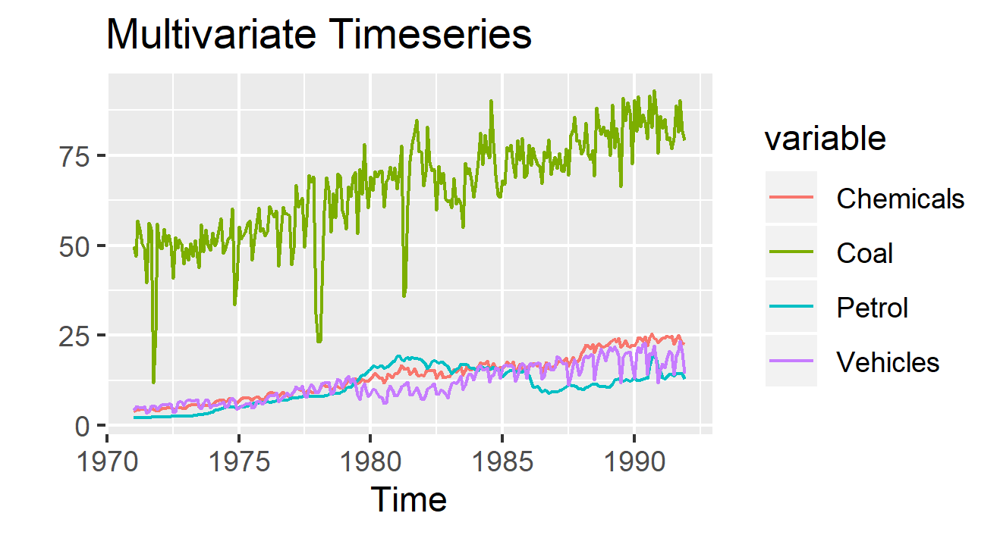

# mlr3forecasting

Forecasting for mlr3

<!-- badges: start -->
[](https://travis-ci.org/mlr-org/mlr3forecasting)
[](https://cran.r-project.org/package=mlr3forecasting)
[](https://codecov.io/gh/mlr-org/mlr3forecasting)
[](https://stackoverflow.com/questions/tagged/mlr3)
<!-- badges: end -->

Time series analysis accounts for the fact that data points taken over time may have an internal structure (such as autocorrelation, trend or seasonal variation) that should be accounted for. This package extends the [mlr3](https://github.com/mlr-org/mlr3) package
framework by timeseries prediction and resampling methods.

<!-- .element height="50%" width="50%" -->

## Installation

Install the development version from
GitHub:

``` r
remotes::install_github("mlr-org/mlr3forecasting")
```

## Forecasting

### Forecasting tasks

| Name          | Code                   | Type                    |
|---------------|------------------------|-------------------------|
| airpassengers | `tsk("airpassengers")` | Univariate Timeseries   |
| petrol        | `tsk("petrol")`        | Multivariate Timeseries |

### Forecasting Learners

| Id                                                                                               | Learner               | Package                                                 |
|--------------------------------------------------------------------------------------------------|-----------------------|---------------------------------------------------------|
| [auto.arima](https://mlr3forecasting.mlr-org.com/reference/mlr_learners_regr.AutoArima.html)     | Auto Arima            | [forecast](https://cran.r-project.org/package=forecast) |
| [forecast.average](https://mlr3forecasting.mlr-org.com/reference/mlr_learners_regr.Average.html) | Average               | base                                                    |
| [VAR](https://mlr3forecasting.mlr-org.com/reference/mlr_learners_regr.VAR.html)                  | Vector Autoregression | [vars](https://cran.r-project.org/package=vars)         |


## Code Example

```r
library(mlr3)
library(mlr3forecasting)
library(tsbox)

# Univariate Timeseries

task = tsk("airpassengers")
learner = LearnerRegrForecastAverage$new()
learner$train(task,row_ids = 1:20)
learner$model
p = learner$predict(task,row_ids = 21:55)
p$score(msr("forecast.mae"))
autoplot(task)
```

## Resampling

#### Holdout 

Split data into a training set and a test set.
Parameter `ratio` determines the ratio of observation going into the training set (default: 2/3).

```r
task = tsk("petrol")
learner = LearnerRegrForecastVAR$new()

rr = rsmp("forecastHoldout", ratio = 0.8)
rr$instantiate(task)
resample = resample(task, learner, rr, store_models = TRUE)
resample$predictions()
```

#### Rolling Window CV 

Splits data using a `folds`-folds (default: 10 folds) rolling window cross-validation.

```r
task = tsk("petrol")
learner = LearnerRegrForecastVAR$new()

rr = rsmp("RollingWindowCV", folds = 5, fixed_window = F)
rr$instantiate(task)
resample = resample(task, learner, rr, store_models = TRUE)
resample$predictions()
```

## More resources

For detailed information on how to get started with {mlr3} please read the 
[mlr3 book](https://mlr3book.mlr-org.com/) and consult the
[Vignette](https://mlr3forecasting.mlr-org.com/articles/vignettes.html) for more examples of mlr3forecasting.

